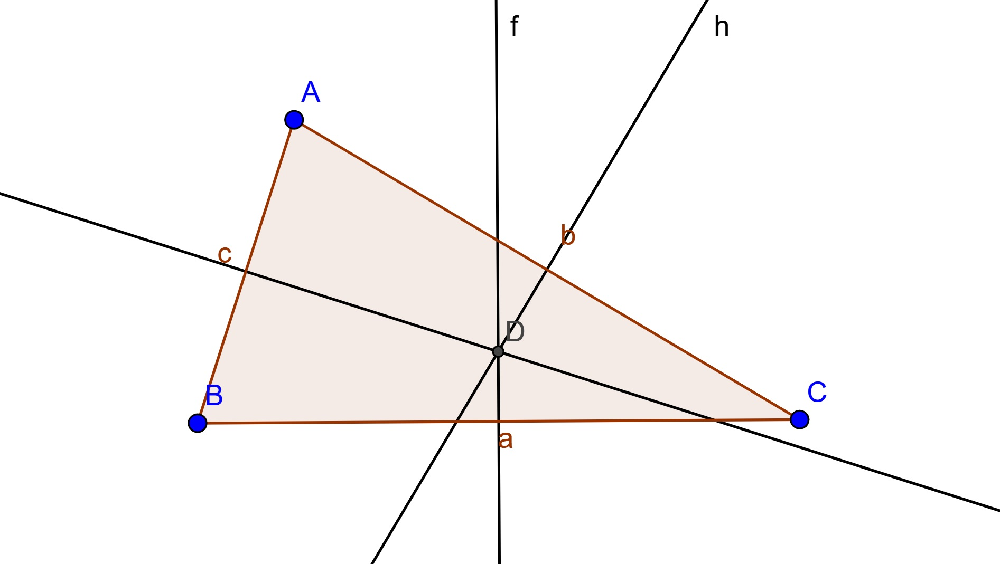

Definició de Mediatriu: Conjunt de punts del pla que equidista dels punts extrems d'un segment. El punt on es tallen les tres mediatrius dona lloc al **circumcentre**, que és el centre de la *circumferència circumscrita* al triangle de referència. 

 