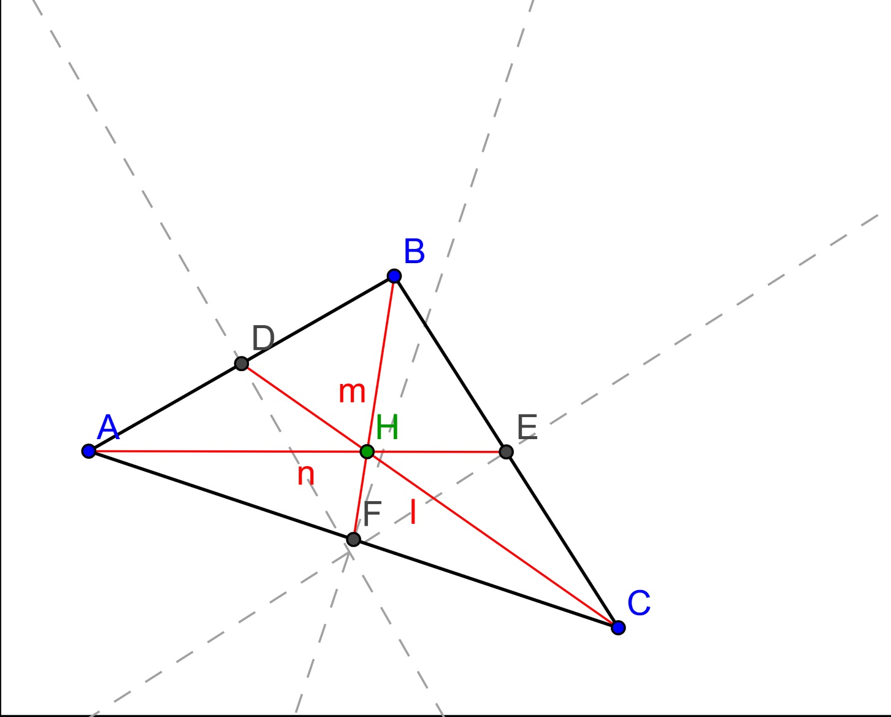

Medianes: 
*Cada mediana és el segment de recta des de cadascun dels vèrtexs fins al punt mitjà del costat oposat.
*Les tres medianes d'un triangle es tallen en un punt que s'anomena **baricentre**.
El baricentre divideix a cada mediana a raó 2:1. És a dir, la longitud del segment de mediana mesurada des del vèrtex al baricentre és el doble que des del baricentre al punt mitjà del costat.

