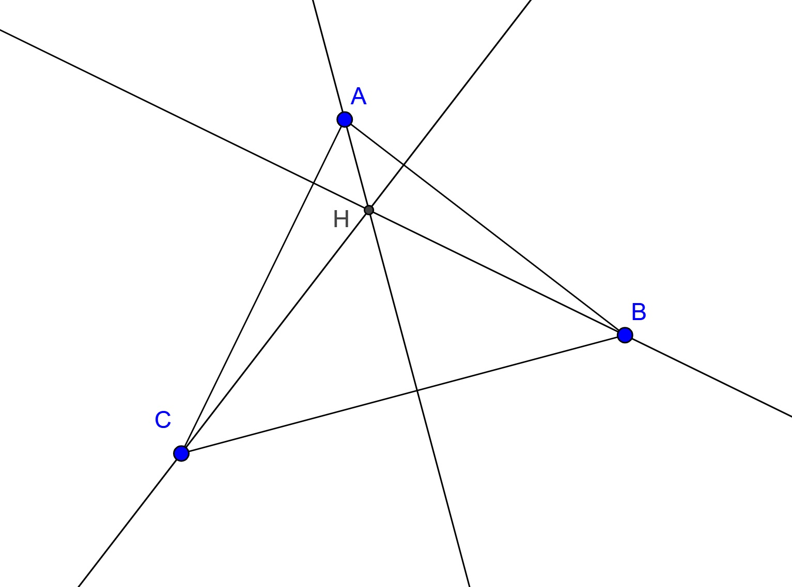

*S'anomena altura d'un triangle al segment perpendicular traçat per un vèrtex del triangle i comprés entre aquest vèrtex i el seu costat oposat.
*Les altures d'un triangle es tallen en un punt que anomenem **ortocentre**.
 

