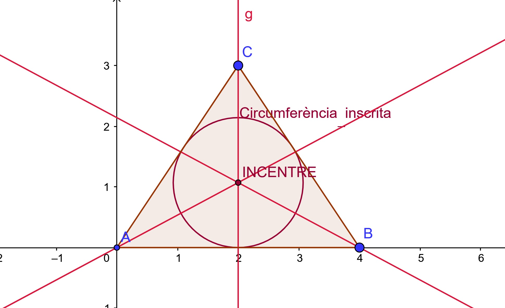

*Bisectriu d'un angle: És el conjunt de punts del pla que equidista dels costats de l'angle. 
*Tot angle té dos bisectrius, una interna i l'altra externa. Les bisectrius interna i externa d'un angle són perpendiculars entre si.
*Les bisectrius dels angles interiors d'un triangle es tallen en un punt que equidista dels costats del triangle i que s'anomena **incentre** del triangle. Aquest és el centre de la ***circumferència inscrita en el triangle*** i sempre és interior al triangle. 

